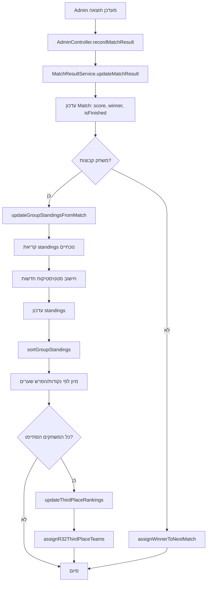

# Match Result Automation

## סקירה כללית

המערכת מעדכנת אוטומטית את דירוג הקבוצות (GroupStandings) כאשר תוצאת משחק מתעדכנת.

## רכיבי המערכת

### 1. MatchResultService

**מיקום:** `backend/src/services/MatchResultService.ts`

**פונקציות עיקריות:**

#### `updateMatchResult(result: MatchResult)`

מעדכנת תוצאת משחק ומפעילה את כל העדכונים הקשורים:

- עדכון תוצאת המשחק (score, winner, isFinished)
- אם זה משחק בשלב קבוצות → עדכון GroupStandings
- אם זה משחק נוקאאוט → הקצאת מנצח לסיבוב הבא
- בדיקה אם שלב הקבוצות הסתיים → עדכון ThirdPlaceRankings

#### `updateGroupStandingsFromMatch()`

מעדכנת את דירוג הקבוצות על בסיס תוצאת משחק:

- מוסיפה משחק שנשחק (played++)
- מעדכנת ניצחונות/תיקו/הפסדים
- מעדכנת שערים בעד ונגד
- מחשבת הפרש שערים
- מחלקת נקודות (3 לניצחון, 1 לתיקו, 0 להפסד)

#### `sortGroupStandings(groupLetter)`

ממיינת קבוצות בתוך קבוצה על פי:

1. **נקודות** (יורד)
2. **הפרש שערים** (יורד)
3. **שערים בעד** (יורד)

**הערה:** השימוש ב-Transaction למניעת התנגשויות Unique Constraint.

#### `updateThirdPlaceRankings()`

מדרגת את 8 הקבוצות השלישיות הטובות ביותר כאשר שלב הקבוצות מסתיים.

#### `assignR32ThirdPlaceTeams()`

מקצה קבוצות שלישיות למשחקים ב-Round of 32 על פי ה-lookup table.

### 2. AdminController

**מיקום:** `backend/src/controllers/AdminController.ts`

**Endpoint:** `POST /api/admin/matches/:id/result`

- קולט `matchNumber` (1-104)
- מוצא את Match על פי matchNumber
- קורא ל-`MatchResultService.updateMatchResult()`
- מחזיר את המשחק המעודכן עם קשרים

**דוגמת Request:**

```json
POST /api/admin/matches/1/result
{
  "scoreA": 2,
  "scoreB": 1
}
```

**דוגמת Response:**

```json
{
  "success": true,
  "data": {
    "id": "...",
    "matchNumber": 1,
    "team1Score": 2,
    "team2Score": 1,
    "winnerId": "...",
    "isFinished": true,
    "team1": { "name": "Mexico", ... },
    "team2": { "name": "South Africa", ... },
    "winner": { "name": "Mexico", ... }
  },
  "message": "Match result recorded successfully"
}
```

## זרימת עבודה (Workflow)

### עדכון תוצאת משחק בשלב קבוצות



### דוגמה: Mexico 2-1 South Africa

**לפני המשחק:**

| Pos | Team          | Pts | GF | GA | GD |
|-----|---------------|-----|----|----|-----|
| 1   | Mexico        | 0   | 0  | 0  | 0   |
| 2   | South Africa  | 0   | 0  | 0  | 0   |
| 3   | Rep. of Korea | 0   | 0  | 0  | 0   |
| 4   | Play-Off D    | 0   | 0  | 0  | 0   |

**אחרי המשחק:**

| Pos | Team          | Pts | P | W | D | L | GF | GA | GD  |
|-----|---------------|-----|---|---|---|---|----|----|-----|
| 1   | Mexico        | 3   | 1 | 1 | 0 | 0 | 2  | 1  | +1  |
| 2   | Rep. of Korea | 0   | 0 | 0 | 0 | 0 | 0  | 0  | 0   |
| 3   | Play-Off D    | 0   | 0 | 0 | 0 | 0 | 0  | 0  | 0   |
| 4   | South Africa  | 0   | 1 | 0 | 0 | 1 | 1  | 2  | -1  |

## Security & Validation

### Authentication

- רק Admins יכולים לעדכן תוצאות משחקים
- דרוש middleware: `requireAdmin`

### Validation (Zod Schema)

```typescript
{
  scoreA: z.number().int().min(0).max(20),
  scoreB: z.number().int().min(0).max(20)
}
```

### Business Rules

1. לא ניתן לעדכן משחק שכבר `isFinished === true`
2. ניקוד: WIN = 3 pts, DRAW = 1 pt, LOSS = 0 pts
3. מיון קבוצות: Points → Goal Diff → Goals For
4. רק 8 קבוצות שלישיות מתקדמות (עם הדירוג הטוב ביותר)

## Testing

יצרנו test script שמדמה עדכון תוצאה:

```bash
npm run db:seed
npx ts-node scripts/test-match-result.ts
```

התוצאות:
✅ Match updated successfully
✅ GroupStandings updated correctly
✅ Sorting works with transaction
✅ Winner assigned correctly

## Models & Schema

### Match

```prisma
model Match {
  id          String   @id @default(cuid())
  matchNumber Int      @unique // 1-104
  stage       Stage    // GROUP, R32, R16, QF, SF, F
  team1Id     String?
  team2Id     String?
  team1Score  Int?
  team2Score  Int?
  winnerId    String?
  isFinished  Boolean  @default(false)
  // ... more fields
}
```

### GroupStanding

```prisma
model GroupStanding {
  id           String   @id @default(cuid())
  groupLetter  String   // A-L
  position     Int      // 1-4
  teamId       String?
  played       Int      @default(0)
  wins         Int      @default(0)
  draws        Int      @default(0)
  losses       Int      @default(0)
  goalsFor     Int      @default(0)
  goalsAgainst Int      @default(0)
  goalDiff     Int      @default(0)
  points       Int      @default(0)
  
  @@unique([groupLetter, position])
}
```

## Future Enhancements

1. **Tiebreakers מתקדמים:** Head-to-head, fair play points
2. **Rollback:** אפשרות לבטל תוצאת משחק
3. **Real-time updates:** WebSocket notifications
4. **Match events:** שערים, כרטיסים, חילופים
5. **Statistics:** נתוני שחקנים, top scorers tracking

---

**עודכן:** 27/12/2025
**מחבר:** AI Assistant

