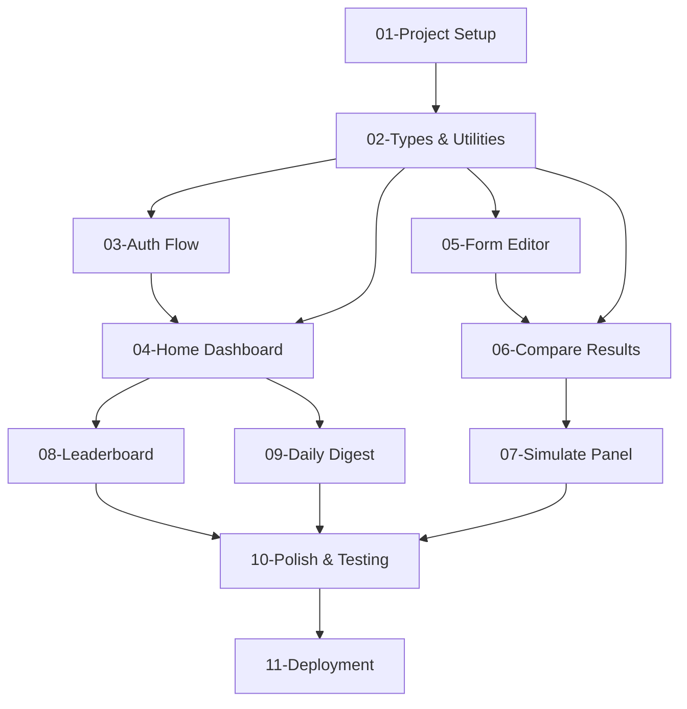

# Frontend Tasks Breakdown

This directory contains a comprehensive breakdown of all frontend development tasks for the World Cup 2024 Guessing Game project.

## Overview

The frontend is built with **Next.js 14** (App Router) + **Tailwind CSS** and follows a clean, utility-first approach without complex state management libraries.

## Task Dependencies



## Task List

| Task | Name                                             | Priority | Est. Time | Dependencies |
| ---- | ------------------------------------------------ | -------- | --------- | ------------ |
| 01   | [Project Setup](./01-project-setup.md)           | Critical | 2-4h      | None         |
| 02   | [Types & Utilities](./02-types-and-utilities.md) | High     | 4-6h      | Task 01      |
| 03   | [Auth Flow](./03-auth-flow.md)                   | Critical | 6-8h      | Task 02      |
| 04   | [Home Dashboard](./04-home-dashboard.md)         | High     | 8-10h     | Task 03      |
| 05   | [Form Editor](./05-form-editor.md)               | High     | 12-15h    | Task 02      |
| 06   | [Compare Results](./06-compare-results.md)       | High     | 8-10h     | Task 02      |
| 07   | [Simulate Panel](./07-simulate-panel.md)         | Medium   | 6-8h      | Task 06      |
| 08   | [Leaderboard Page](./08-leaderboard-page.md)     | Medium   | 6-8h      | Task 04      |
| 09   | [Daily Digest](./09-daily-digest.md)             | Low      | 6-8h      | Task 02, 04  |
| 10   | [Polish & Testing](./10-polish-and-testing.md)   | Critical | 10-12h    | All previous |
| 11   | [Deployment](./11-deployment.md)                 | Critical | 4-6h      | Task 10      |

**Total Estimated Time:** 72-95 hours

## Development Phases

### Phase 1: Foundation (20-26 hours)

- Tasks 01-03: Project setup, types, and authentication
- **Deliverable:** Working login flow and basic app structure

### Phase 2: Core Features (34-43 hours)

- Tasks 04-06: Dashboard, form editor, and results comparison
- **Deliverable:** Complete prediction workflow

### Phase 3: Enhanced Features (18-24 hours)

- Tasks 07-09: Simulation, leaderboard, and daily digest
- **Deliverable:** Full feature set with engagement tools

### Phase 4: Production Ready (14-18 hours)

- Tasks 10-11: Polish, testing, and deployment
- **Deliverable:** Production-ready application

## Key Technologies

- **Framework:** Next.js 14 with App Router
- **Styling:** Tailwind CSS 3
- **Data Fetching:** Native fetch + SWR
- **Authentication:** HttpOnly cookies
- **Real-time:** Server-Sent Events (SSE)
- **Icons:** Heroicons
- **Deployment:** Vercel

## File Structure

```
frontend/
├── app/
│   ├── (public)/          # Public routes (login, callback)
│   ├── (private)/         # Protected routes (dashboard, forms)
│   └── middleware.ts      # Auth middleware
├── components/            # Reusable UI components
├── lib/                   # Utilities and types
│   ├── types.ts          # TypeScript interfaces
│   ├── fetcher.ts        # API wrapper
│   ├── useSession.ts     # Session management
│   └── useDigest.ts      # SSE hook
└── public/               # Static assets
```

## Development Guidelines

### Code Standards

- Use TypeScript strict mode
- Functional components with hooks
- Tailwind for all styling
- No global state management
- Component-level state only

### UI Principles

- Mobile-first responsive design
- Clean, minimal interface
- Consistent spacing and typography
- Accessibility (WCAG 2.1 AA)
- Fast loading with skeletons

### Performance Targets

- Lighthouse score > 90
- First Contentful Paint < 2s
- Time to Interactive < 3s
- Bundle size < 500KB

## Getting Started

1. Start with **Task 01: Project Setup**
2. Follow the dependency chain
3. Test each task thoroughly before moving to the next
4. Use the provided code examples as starting points
5. Refer to the main design documents for detailed specifications

## Architecture Decisions

### Why Next.js 14?

- App Router for modern React patterns
- Built-in optimization features
- Excellent Vercel integration
- File-system based routing

### Why No State Management Library?

- Simple application scope
- Local component state sufficient
- SWR handles server state
- Reduces bundle size and complexity

### Why Tailwind CSS?

- Utility-first approach
- Consistent design system
- Excellent performance
- No CSS-in-JS overhead

## Testing Strategy

Each task includes testing scenarios, but focus on:

- **Unit tests** for utility functions
- **Integration tests** for API calls
- **Manual testing** for user flows
- **Accessibility testing** with screen readers
- **Performance testing** with Lighthouse

## Questions or Issues?

If you encounter issues or need clarification on any task:

1. Check the main design documents first
2. Review the specific task requirements
3. Look at the code examples provided
4. Consider the overall architecture decisions

Each task is designed to be self-contained with clear objectives and acceptance criteria.
